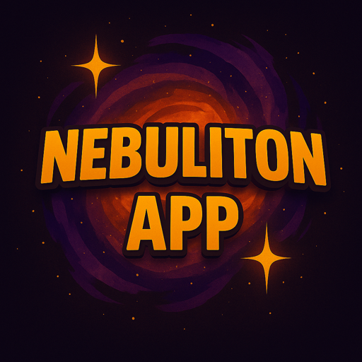

# 🚀 Nebuliton App

**Deine Game-Server. Immer dabei.**  
Die Nebuliton App ist deine zentrale Lösung, um Minecraft- und andere Gameserver direkt vom Smartphone oder Tablet aus zu steuern – egal ob zu Hause, unterwegs oder auf der anderen Seite der Welt.

> ⚠️ **Hinweis:** Diese App ist ausschließlich für Kundinnen und Kunden von **Nebuliton** nutzbar.

---

## 📱 Funktionen

- Server starten, stoppen und überwachen
- Pakete upgraden – jederzeit und überall
- Rechnungen, Account & Support im Blick
- Nahtlose Integration mit Pterodactyl & Clientexec
- Optimiert für Mobilgeräte – installierbar als PWA

---

## 🔧 Installation

### 📲 iOS (iPhone / iPad)

1. [WebApp öffnen](https://talonachris.github.io/nebuliton-app/) in **Safari**
2. Teilen-Symbol antippen
3. „Zum Home-Bildschirm hinzufügen“ auswählen

### 🤖 Android (Chrome)

1. [WebApp öffnen](https://talonachris.github.io/nebuliton-app/) im **Chrome-Browser**
2. Oben rechts auf das Drei-Punkte-Menü tippen
3. „Zum Startbildschirm hinzufügen“ auswählen
4. App-Name bestätigen → Fertig!

> Die App wird wie eine normale Anwendung auf deinem Android-Gerät installiert – ganz ohne APK.

---

## 🌐 Demo

👉 [Zur App-Webseite](https://talonachris.github.io/nebuliton-app/)  
👉 [Info-Seite anzeigen](https://talonachris.github.io/nebuliton-app/appinfo.html)

---

## 🖼 Screenshots

> 🛠️ **Coming soon – Einblicke in die App folgen in Kürze!**

---

## 🧑‍💻 Entwickler

**Erstellt von [Talonachris](https://github.com/Talonachris)**  
**Serverschmiede der Galaxien** – das ist **Nebuliton**.

---

## 📄 Lizenz

Dieses Projekt ist Open Source unter der [MIT License](LICENSE).
